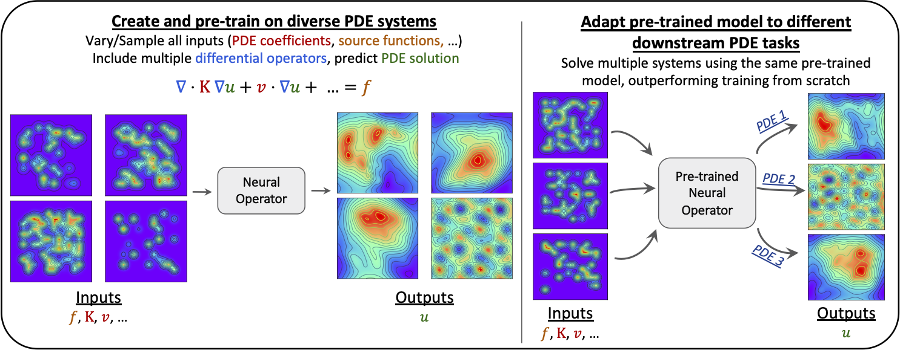

# Thesis FNO Constraints

This repository contains the code used for thesis experiments on transfer
learning and constraint-aware pretraining for Fourier Neural Operators (FNOs)
on scientific machine-learning PDE tasks.

The project builds on
[ShashankSubramanian/neuraloperators-TL-scaling](https://github.com/ShashankSubramanian/neuraloperators-TL-scaling),
which studies scaling and transfer behavior of neural operators on Poisson,
Advection-Diffusion, and Helmholtz systems. This fork keeps the original
training stack and extends it with mixed-PDE foundation-model experiments,
physics-informed constraints, boundary-condition conditioning, expanded
evaluation workflows, and DAIC/SLURM automation.



## What Is In This Repository

- FNO training and inference code for Poisson, Advection-Diffusion, and
  Helmholtz PDE datasets.
- Mixed-format datasets that combine all three PDE families into one
  pretraining distribution with a canonical coefficient layout.
- Transfer-learning workflows comparing mixed pretraining, single-domain
  pretraining, and from-scratch downstream training.
- Constraint-aware training losses for PDE residual penalties, augmented
  Lagrangian experiments, zero-mode constraints, and boundary-condition
  enforcement.
- Boundary-conditioned data generation and model inputs for non-zero
  Dirichlet boundary conditions.
- Reproduction, evaluation, plotting, container, and SLURM scripts for local
  runs and TU Delft DAIC cluster runs.

## Repository Layout

```text
config/                     YAML experiment configs and W&B sweep configs
models/                     FNO and supporting model modules
utils/                      Data loading, training, loss, inference, logging
scripts/data/               PDE data generation and mixed-dataset builders
scripts/entrypoints/        Train and evaluation entrypoints
scripts/eval/               Transfer/OOD evaluation and plotting helpers
scripts/experiments/        Sweep and staged experiment launch helpers
scripts/slurm/              DAIC/SLURM jobs for data, pretraining, finetuning, eval
scripts/container/          Docker/Apptainer build and transfer helpers
docs/transfer-learning/     Detailed transfer, mixed-data, and constraint docs
```

The most useful detailed docs are:

- [QUICK_START.md](QUICK_START.md) for a minimal local sanity run.
- [REPRODUCTION_GUIDE.md](REPRODUCTION_GUIDE.md) for reproducing the upstream
  baseline experiments.
- [DAIC_SETUP.md](DAIC_SETUP.md) for DAIC cluster setup.
- [docs/transfer-learning/README.md](docs/transfer-learning/README.md) for the
  thesis-specific transfer-learning and constraint documentation index.

## Environment

The original project targets PyTorch 1.12 with CUDA 11.3. For local use:

```bash
python -m venv venv
source venv/bin/activate
pip install -r requirements.txt
```

On DAIC, prefer the container or setup scripts described in
[DAIC_SETUP.md](DAIC_SETUP.md):

```bash
make build-container
make transfer-container NETID=<your-netid>
```

For direct Python entrypoints, make sure the repository root is on
`PYTHONPATH`:

```bash
export PYTHONPATH="$(pwd):$PYTHONPATH"
```

## Quick Verification

Run the small smoke workflow before launching full experiments:

```bash
chmod +x scripts/workflows/quick_test.sh
./scripts/workflows/quick_test.sh
```

This generates a small Poisson dataset, computes normalization scales, trains a
small FNO for a few epochs, and checks that the training loop behaves
sensibly.

For constraint-specific smoke tests:

```bash
bash scripts/workflows/run_local_smoke_train_eval_constraints.sh
bash scripts/workflows/run_local_smoke_train_eval_bc_constraints.sh
```

## Data

Datasets are HDF5 files with the original neuraloperators convention:

- `fields`: `(N, 2, nx, ny)`, where channel `0` is the source term and channel
  `1` is the PDE solution.
- `tensor`: PDE coefficients.

The thesis extensions add two important formats.

Mixed datasets use a canonical six-component tensor:

```text
[k11, k12, k22, vx, vy, omega]
```

with per-system padding:

```text
Poisson:    [k11, k12, k22,  0,  0,     0]
AdvDiff:    [k11, k12, k22, vx, vy,     0]
Helmholtz:  [k,   0,   k,   0,  0, omega]
```

Boundary-conditioned datasets additionally store:

- `bc`: `(N, 2, nx, ny)`, where channel `0` is the boundary value map and
  channel `1` is the boundary mask.

Useful commands:

```bash
python scripts/data/gen_data_poisson.py --help
python scripts/data/gen_data_advdiff.py --help
python scripts/data/gen_data_helmholtz.py --help
python scripts/data/create_mixed_dataset.py --help
python scripts/data/compute_scales.py --help
```

For boundary-conditioned generation:

```bash
python scripts/data/gen_data_poisson_bc.py --help
python scripts/data/gen_data_advdiff_bc.py --help
python scripts/data/gen_data_helmholtz_bc.py --help
python scripts/data/create_mixed_dataset.py --require_bc --help
```

See [docs/transfer-learning/MIXED_DATASETS.md](docs/transfer-learning/MIXED_DATASETS.md)
and [docs/transfer-learning/BC_CONDITIONED.md](docs/transfer-learning/BC_CONDITIONED.md)
for the full data contracts.

## Training

The main training entrypoint is:

```bash
python scripts/entrypoints/train.py \
  --yaml_config config/operators_poisson.yaml \
  --config poisson-scale-k1_5 \
  --run_num local-test \
  --root_dir experiments
```

Important config families:

- `config/operators_poisson.yaml`: Poisson pretraining, finetuning, OOD, and
  transfer configs.
- `config/operators_ad.yaml`: Advection-Diffusion configs.
- `config/operators_helmholtz.yaml`: Helmholtz configs.
- `config/operators_mixed.yaml`: mixed-PDE pretraining, mixed transfer, and
  constrained mixed-pretraining presets.
- `config/operators_mixed_bc.yaml`: boundary-conditioned mixed pretraining and
  BC enforcement ablations.

On DAIC, use the SLURM wrappers in `scripts/slurm/` rather than launching long
runs manually. Examples:

```bash
sbatch scripts/slurm/pretrain/submit_pretrain_mixed.sh
sbatch scripts/slurm/pretrain/submit_pretrain_mixed_bc.sh
sbatch scripts/slurm/finetune/poisson/submit_finetune_poisson_k1_2p5_mixed_array.sh
```

## Constraint Experiments

Constraint-aware training is implemented in `utils/loss_utils.py` and wired
through the trainer and inferencer. The main supported modes are:

- PDE residual objectives with either `penalty` or `augmented_lagrangian`.
- Zero-mode enforcement with `off`, `hard`, or `soft` modes.
- Boundary-condition enforcement with `off`, `soft`, `hard`, or `hard+soft`.

The strict foundation-model constraint protocol is documented in
[docs/transfer-learning/CONSTRAINTS.md](docs/transfer-learning/CONSTRAINTS.md).
Typical staged launches are:

```bash
bash scripts/experiments/submit_constraints_stage_a.sh
bash scripts/experiments/submit_constraints_stage_b.sh
bash scripts/experiments/submit_constraints_stage_c.sh penalty
```

Boundary-conditioned soft/hard comparisons are documented in
[docs/transfer-learning/BC_CONDITIONED.md](docs/transfer-learning/BC_CONDITIONED.md).

## Evaluation

Standard evaluation uses:

```bash
python scripts/entrypoints/eval.py --help
python scripts/entrypoints/eval_transfer_learning.py --help
```

Transfer-learning evaluations compare:

- mixed-pretrained finetuning,
- single-domain pretrained finetuning,
- from-scratch training.

For the main Poisson transfer bundle:

```bash
sbatch scripts/slurm/eval/submit_eval_poisson_transfer.sh
```

Additional OOD and transfer bundles are available for Poisson,
Advection-Diffusion, and Helmholtz under `scripts/slurm/eval/`. Plotting
helpers live in `scripts/eval/`.

See [docs/transfer-learning/EVALUATION.md](docs/transfer-learning/EVALUATION.md)
for details.

## Experiment Tracking

Many configs support Weights & Biases logging through:

```yaml
log_to_wandb: true
entity: rowdey_goos-tu-delft
project: neuraloperators
```

Sweep definitions live in `config/sweep_*.yaml`, with launch helpers in
`scripts/experiments/` and `scripts/slurm/pretrain/`.

## Provenance

This repository is derived from
[ShashankSubramanian/neuraloperators-TL-scaling](https://github.com/ShashankSubramanian/neuraloperators-TL-scaling).
The upstream project accompanies:

```bibtex
@inproceedings{subramanian2023towards,
  title={Towards Foundation Models for Scientific Machine Learning: Characterizing Scaling and Transfer Behavior of Neural Operators},
  author={Subramanian, Shashank and Harrington, Peter and Keutzer, Kurt and Bhimji, Wahid and Morozov, Dmitriy and Mahoney, Michael and Gholami, Amir},
  booktitle={NeurIPS 2023 AI for Science Workshop},
  year={2023}
}
```

If you use this thesis fork, cite the upstream work and cite the thesis/report
associated with this repository where appropriate.
