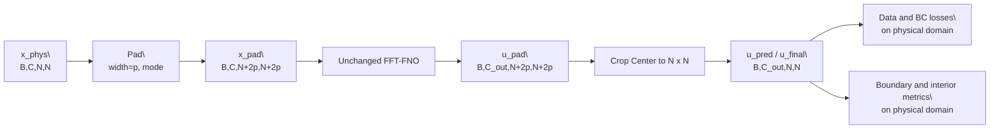

# BC-Conditioned Mixed Pretraining: Implementation Guide

This document explains how the boundary-conditioned (BC) pipeline is implemented end-to-end in this branch:

- BC-aware data generation for Poisson / Advection-Diffusion / Helmholtz.
- BC-aware mixed dataset assembly.
- Optional BC channel loading.
- BC constraint integration (`off | soft | hard | hard+soft`) during training and evaluation.
- BC metrics and checkpoint migration behavior.
- Smoke-test workflow for quick validation.

## 1) High-level flow

1. Generate BC datasets per PDE system with keys: `fields`, `tensor`, `bc`.
2. Build mixed dataset with keys: `fields`, `tensor`, `labels`, `bc`.
3. Train FNO with `in_dim=9` and BC channels enabled.
4. Use dual prediction flow:
   - `u_raw = model(inputs)`
   - `u_final = project_bc(u_raw, g, m)` for hard modes
5. Compute:
   - data loss on `u_final`
   - BC soft loss on `u_raw` for `soft` and `hard+soft`
6. Log BC metrics for raw and final predictions.

## 1.1) Architecture diagram

```mermaid
flowchart LR
  subgraph G1[BC Data Generation]
    P[gen_data_poisson_bc.py]
    A[gen_data_advdiff_bc.py]
    H[gen_data_helmholtz_bc.py]
    B[bc_sampling.py<br/>sample g,m]
    F[fd_bc_utils.py<br/>solve_dirichlet_fd]
    P --> B
    A --> B
    H --> B
    P --> F
    A --> F
    H --> F
  end

  subgraph G2[Mixed Assembly]
    M[create_mixed_dataset.py<br/>--require_bc]
    D1[(Poisson BC h5)]
    D2[(AdvDiff BC h5)]
    D3[(Helmholtz BC h5)]
    D1 --> M
    D2 --> M
    D3 --> M
    MM[(Mixed BC h5<br/>fields,tensor,labels,bc)]
    M --> MM
  end

  subgraph G3[Training and Eval]
    L[data_utils.py<br/>optional BC channels]
    T[trainer.py]
    I[inferencer.py]
    O[loss_utils.py]
    R[u_raw = model(x)]
    Pj[u_final = project_bc(u_raw,g,m)]
    MM --> L --> T
    MM --> L --> I
    T --> O
    I --> O
    O --> R --> Pj
  end

  subgraph G4[Constraint Logic]
    C1[mode=off]
    C2[mode=soft]
    C3[mode=hard]
    C4[mode=hard+soft]
    S1[data loss on u_final]
    S2[BC soft loss on u_raw]
    S3[bc_violation_raw/final]
    C1 --> S1
    C2 --> S1
    C2 --> S2
    C3 --> S1
    C4 --> S1
    C4 --> S2
    S1 --> S3
    S2 --> S3
  end

  Pj --> C1
  Pj --> C2
  Pj --> C3
  Pj --> C4
```

## 2) File map

### Core BC data generation
- `utils/bc_sampling.py`
- `utils/fd_bc_utils.py`
- `utils/gen_data_poisson_bc.py`
- `utils/gen_data_advdiff_bc.py`
- `utils/gen_data_helmholtz_bc.py`

### Dataset assembly and loading
- `utils/create_mixed_dataset.py`
- `utils/data_utils.py`

### Training / inference integration
- `utils/loss_utils.py`
- `utils/trainer.py`
- `utils/inferencer.py`

### Configs
- `config/operators_mixed_bc.yaml`
- `config/operators_local_smoke_bc.yaml`

### Smoke tooling
- `scripts/utils/check_bc_dataset_sanity.py`
- `scripts/utils/run_local_smoke_train_eval_bc_constraints.sh`

## 3) Data contract

BC-enabled HDF5 files use:

- `fields`: shape `(N, 2, nx, ny)`
  - `fields[:,0]`: source
  - `fields[:,1]`: solution
- `tensor`: system-specific coefficients (same semantics as legacy generators)
- `bc`: shape `(N, 2, nx, ny)`
  - `bc[:,0]`: boundary value map `g(x,y)`
  - `bc[:,1]`: boundary mask `m(x,y)` (`1` on boundary, `0` in interior)

Mixed BC datasets additionally store:

- `labels`: `0=Poisson`, `1=AdvDiff`, `2=Helmholtz`

Model input channel layout for BC mixed training (`in_dim=9`):

- `0`: source
- `1..6`: tensor-expanded channels `[k11, k12, k22, vx, vy, omega]`
- `7`: BC value map `g`
- `8`: BC mask `m`

## 4) How BC data generation works

## 4.1 Boundary sampling (`utils/bc_sampling.py`)

- `boundary_mask(nx, ny, width=1)` creates a one-cell ring mask.
- `sample_boundary_value_map(...)` creates smooth random boundary traces by Fourier-mode sampling per edge.
- `sample_bc_pair(...)` returns `(g, m)` and enforces `g` only on boundary with `g = g * m`.
- `sample_bc_batch(...)` is deterministic under seed via `np.random.default_rng(seed)`.

Properties:

- `m` is binary.
- `g` is zero in interior.
- corner values are blended from adjacent edges for continuity.

## 4.2 Finite-difference Dirichlet solver (`utils/fd_bc_utils.py`)

The solver `solve_dirichlet_fd(...)` solves:

`k11*u_xx + 2*k12*u_xy + k22*u_yy - vx*u_x - vy*u_y + omega*u + source = 0`

with Dirichlet boundary values from `g`.

Implementation details:

- Uniform rectangular grid with `dx = lx/(nx-1)`, `dy = ly/(ny-1)`.
- Unknowns are interior nodes only.
- Sparse linear system assembled with 9-point stencil:
  - center
  - east/west/north/south
  - northeast/northwest/southeast/southwest (for mixed derivative `u_xy`)
- Boundary neighbors are moved to RHS using `g`.
- Solved with `scipy.sparse.linalg.spsolve`.
- Final field `u` is reconstructed by filling interior solution + exact boundary `g`.

## 4.3 Per-system generators

### Poisson BC (`utils/gen_data_poisson_bc.py`)

- Samples diffusion tensor via random rotation/eigenvalue draw.
- Scales diffusion by `diff_coef_scale` (default `0.01`) to match existing conventions.
- Builds RBF source and BC pair `(g,m)`.
- Solves with FD Dirichlet solver (`vx=vy=omega=0`).
- Writes `tensor=[k11,k12,k22]`.

### AdvDiff BC (`utils/gen_data_advdiff_bc.py`)

- Samples diffusion tensor + velocity direction.
- Preserves existing ADR/lambda semantics by loading `utils/lambda.npy` and `utils/ads.npy` and mapping sampled ADR to nearest lambda.
- Applies scale factors:
  - diffusion scaled by `(1-lam)*diff_coef_scale`
  - advection scaled by `lam*adv_coef_scale`
- Solves FD Dirichlet system with `vx, vy`.
- Writes `tensor=[k11,k12,k22,vx,vy]`.

### Helmholtz BC (`utils/gen_data_helmholtz_bc.py`)

- Samples integer `omega` in `[o1,o2]`.
- Uses isotropic diffusion `k11=k22=diff_coef_scale`, `k12=0`.
- Solves FD Dirichlet system with Helmholtz term `omega*u`.
- Rejects unstable outliers via `max_abs_solution` check.
- Writes `tensor=[diff_coef_scale, omega]`.

## 5) Mixed BC dataset assembly

`utils/create_mixed_dataset.py` now supports `--require_bc`.

When enabled:

- requires `bc` in each source dataset.
- validates `bc` shape `(N,2,nx,ny)` for all three systems.
- concatenates `fields`, `tensor`, `labels`, and `bc`.
- shuffles all keys with the same permutation to preserve alignment.
- writes `bc` to output and sets HDF5 attribute `has_bc=true`.

Tensor unification remains canonical:

- Poisson -> `[k11,k12,k22,0,0,0]`
- AdvDiff -> `[k11,k12,k22,vx,vy,0]`
- Helmholtz -> `[k,0,k,0,0,omega]`

## 6) Data loading with optional BC channels

`utils/data_utils.py` behavior:

- Detects optional `bc` key.
- Validates exact shape against `fields`.
- Appends BC channels only if `use_bc_channels=true` and `bc` exists.
- Leaves legacy behavior unchanged when BC is absent or disabled.

Input composition at load-time:

1. Start from `fields` input channels (source).
2. Expand `tensor` values into spatial channels.
3. Append `bc` channels (`g,m`) if enabled.

Important note about normalization:

- If `scales_path` is set, loader currently divides **all** input channels by `f_scaling` (source-based).
- Then tensor channels are additionally rescaled by coefficient scales.
- BC channels are therefore still affected by the global `f_scaling` step in current implementation.

## 7) Boundary constraints integration in loss/training

## 7.1 Config knobs (in `loss_utils.py`)

- `use_bc_channels`
- `bc_value_channel_idx`, `bc_mask_channel_idx`
- `constraint_bc_enforcement`: `off | soft | hard | hard+soft`
- `constraint_bc_weight`
- `constraint_bc_warmup_fraction`
- `constraint_bc_eps`
- `constraint_bc_loss_norm`: `l2 | l1`
- `constraint_pde_discretization`: `spectral | fd`

## 7.2 Projection and soft BC loss

### Hard projection

Used in `hard` and `hard+soft`:

`u_final = u_raw*(1 - m) + g*m`

This is exact on boundary wherever `m=1`.

### Soft BC loss

Computed on `u_raw` for `soft` and `hard+soft`:

- residual: `r = (u_raw - g)*m`
- denominator: `mean(m) + eps`
- `l2`: `mean(r^2)/denom`
- `l1`: `mean(|r|)/denom`

Weighted by warmup-scaled `constraint_bc_weight`.

## 7.3 Metric definitions

- `bc_violation_raw`: BC violation on `u_raw`
- `bc_violation_final`: BC violation on `u_final`

For `l2`, metric uses RMS-style value:

`sqrt(mean(r^2)/denom)`

For `l1`, metric uses:

`mean(|r|)/denom`

Interior metric:

- `val_err_interior` / `test_err_interior`: relative L2 over interior mask `(1-m)`.

## 7.4 Dual prediction flow in trainer/inferencer

In both `trainer.py` and `inferencer.py`:

1. `u_raw = model(inputs)`
2. `u_final = loss_func.project_bc(inputs, u_raw)`
3. data loss on `u_final`
4. PDE loss on `u_final`
5. BC soft loss on `u_raw` (if enabled)
6. zero-mode soft loss on `u_final`
7. errors/log metrics use `u_final`

This ensures:

- hard modes are enforced at output level,
- soft BC still shapes the raw model prediction when requested.

## 7.5 Enforcement mode semantics

- `off`
  - no projection
  - no BC soft loss
- `soft`
  - no projection
  - soft BC loss active
- `hard`
  - projection active
  - no BC soft loss
- `hard+soft`
  - projection active
  - soft BC loss active on raw output

## 8) PDE residual path selector (`spectral|fd`)

`constraint_pde_discretization` is parsed and validated in `loss_utils.py`.

Current status:

- `spectral`: existing residual path (active).
- `fd`: phase-2 scaffold currently routed to the same spectral implementation as placeholder.

So the switch exists for config/API compatibility, but non-periodic FD residual loss is not yet active in phase 1.

## 9) Checkpoint migration (7 -> 9 input channels)

Implemented in both `trainer.py` and `inferencer.py`.

During load:

1. normalize key namespace (`module.` vs non-`module.`).
2. detect `fc0.weight` input-channel mismatch.
3. if checkpoint has fewer input columns than model expects:
   - copy existing columns,
   - zero-init new columns (BC channels).
4. load strictly afterward.

This enables warm-start from legacy mixed checkpoints (`in_dim=7`) into BC models (`in_dim=9`).

## 10) Smoke-test workflow

## 10.1 Dataset sanity checker

Use:

```bash
python scripts/utils/check_bc_dataset_sanity.py --input data/local_smoke_bc/poisson --glob "*.h5"
```

Checks:

- keys and shape contract,
- NaN/Inf,
- binary `m`,
- interior leakage of `g`,
- boundary MAE between solution and `g`.

## 10.2 Full local BC smoke run

Use:

```bash
bash scripts/utils/run_local_smoke_train_eval_bc_constraints.sh
```

It performs:

1. tiny BC dataset generation for all 3 systems,
2. sanity checks,
3. mixed BC train/val/test assembly,
4. one-epoch train+eval for `off`, `soft`, `hard`, `hard+soft`,
5. log validation for BC metrics,
6. strict boundary checks (`bc_violation_final <= 1e-6`) for hard modes.

## 11) Key guarantees and current limitations

Guaranteed by current phase-1 implementation:

- BC dataset schema with `bc` channel contract.
- BC-aware mixed data and optional loader integration.
- Runtime BC enforcement with all four modes.
- Hard projection applied exactly at output assembly step.
- BC metrics logged for raw and final outputs.
- Backward-compatible load path for older mixed checkpoints.

Known limitations:

- FD residual loss path in `loss_utils.py` is scaffold-only in phase 1.
- BC channels are affected by global source normalization when `scales_path` is used.
- No Neumann/Robin BC support in this rollout.

## 12) Future Experiment: FFT Seam Isolation via Pad→Crop (Option B)

Status: this is a **future experimental track** and is **not implemented** in the current phase-1 code path.

### 12.1 Motivation

For FFT-based FNO, implicit periodicity can create seam artifacts that contaminate physical boundaries on non-periodic BC data.  
The idea is to move the artificial seam into a padded halo and evaluate only on the cropped physical domain.

### 12.2 Proposed mechanism (forward path)

Given physical-domain input:

- `x_phys`: `[B, C, N, N]`

Future path:

1. `x_pad = pad(x_phys, p, mode)`  -> `[B, C, N+2p, N+2p]`
2. `u_pad = fno(x_pad)`            -> unchanged FFT-FNO backbone
3. `u_pred = crop_center(u_pad, N)` -> `[B, C_out, N, N]`
4. Compute losses and metrics on `u_pred` (cropped physical domain).

### 12.3 Recommended initial defaults

- `p = 8` for `N=64`
- `p = 16` for `N=128`
- start with `pad_mode='replicate'`
- keep BC channels and BC loss/projection active

### 12.4 Proposed future config knobs

These are documentation-only knobs for future implementation planning:

- `seam_padding_enable: bool`
- `seam_padding_width: int`
- `seam_padding_mode: replicate|constant|reflect`
- `seam_crop_to_physical: bool`

All are **future knobs** and **not active** in current phase-1 runs.

### 12.5 Interaction with current BC enforcement (future behavior)

If this track is implemented later:

- data loss should be computed on cropped `u_final`
- soft BC loss should be computed on cropped `u_raw` boundary
- hard projection should be applied on cropped physical-domain boundary (not padded outer boundary)
- boundary metrics should be computed on cropped domain only

### 12.6 Experimental matrix (future ablation plan)

- `p in {0, 4, 8, 12, 16}`
- `pad_mode in {replicate, constant}`
- BC enforcement in `{off, soft, hard, hard+soft}` (at minimum compare hard vs soft)
- compare to current no-padding BC baseline

### 12.7 Acceptance criteria (future implementation)

- no architecture change to FNO blocks
- train/eval path supports pad→crop consistently
- hard-mode `bc_violation_final` remains near zero
- boundary error improves vs `p=0` without interior-regression

### 12.8 Risks and notes

- compute/memory increase is approximately `((N+2p)/N)^2`
- if PDE residual is enabled later, residual definition must be consistent with cropped physical domain

### 12.9 Mermaid flow (future track)


